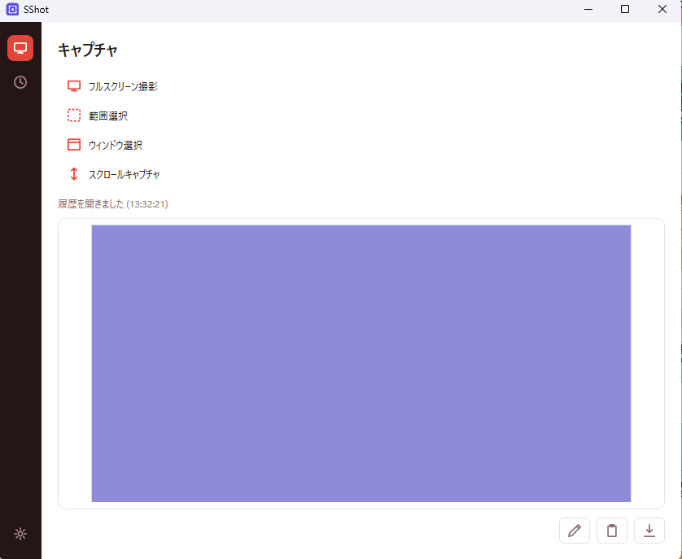
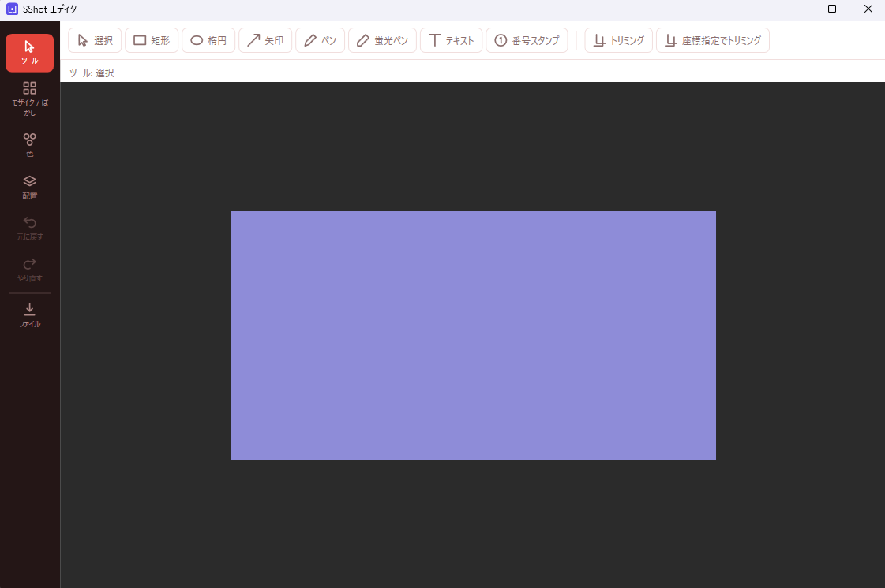

# SShot

Windows向けスクリーンショット撮影・編集ソフトウェア(C# / .NET 10, WPF)。

範囲選択・ウィンドウ・フルスクリーン(マルチモニタ・DPI混在対応)・スクロールキャプチャに対応し、
矢印/テキスト/図形/モザイク・ぼかしなどの編集機能、クリップボード/ローカル保存、
タスクトレイ常駐+グローバルホットキー、日本語/英語UIを備える。

| メインウィンドウ | エディター |
| --- | --- |
|  |  |

## 主な機能

- **キャプチャ** — 範囲選択 / アクティブウィンドウ / フルスクリーン(マルチモニタ・DPI混在) / スクロールキャプチャ
- **編集** — 矢印・テキスト・図形・フリーハンド・ハイライト・モザイク/ぼかし・番号スタンプ・トリミング、Undo/Redo
- **出力** — クリップボードへコピー、PNG / JPEG でのファイル保存
- **常駐** — タスクトレイ + グローバルホットキー、自動起動(設定でON/OFF)
- **履歴** — 直近20件のキャプチャをサムネイル一覧で再表示
- **UI** — 日本語 / 英語、10種のカラーテーマ、サイドバー / フローティングの2レイアウト

### 既定のホットキー

| 操作 | キー |
| --- | --- |
| 範囲選択 | `Ctrl+Shift+R` |
| アクティブウィンドウ | `Ctrl+Shift+W` |
| フルスクリーン | `Ctrl+Shift+F` |
| スクロールキャプチャ | `Ctrl+Shift+S` |

いずれも設定画面から変更できる。

## 動作環境

- Windows 10 / 11 (64bit)
- **.NET ランタイムのインストールは不要** — 配布物は自己完結型で、ランタイムを内包している

## インストール

[Releases](https://github.com/ytt0601/SShot/releases) から2種類の配布物を提供している。

### どちらを選ぶか

| | ポータブル版 (`SShot.App.exe`) | インストーラー版 (`SShot-Setup.msi`) |
| --- | --- | --- |
| インストール | 不要。exeを置くだけ | `Program Files\SShot\` に配置 |
| 管理者権限 | 不要 | 必要 |
| スタートメニュー | 登録されない | 登録される |
| アンインストール | exeを手動削除 | 「アプリと機能」から削除 |
| 自動起動 | **exeを移動すると壊れる**(下記) | 安定 |

**自動起動を使う場合はインストーラー版を推奨する。** 自動起動の設定はレジストリに exe の絶対パスを
書き込むため、ポータブル版の exe を後から別フォルダへ移動・削除すると、サインインのたびに
Windows が存在しないパスを起動しようとして失敗し続ける。インストーラー版は配置場所が固定される
ためこの問題が起きず、アンインストール時に自動起動の登録も併せて削除される。

インストール不要で試したい場合や、管理者権限のない環境ではポータブル版を使う。

### 「WindowsによってPCが保護されました」と表示される場合

本アプリは**コード署名を行っていない**ため、ダウンロード時に SmartScreen の警告が表示される。
実行するには「詳細情報」→「実行」を選択する。

署名がないことに加え、本アプリは画面キャプチャ・入力の合成・グローバルホットキーという
マルウェアと機能的に区別しづらい処理を行うため、アンチウイルスによる誤検知が起きる可能性もある。

配布物の同一性は、Releases に記載の SHA256 と照合することで確認できる。

```powershell
Get-FileHash .\SShot.App.exe -Algorithm SHA256
```

## 設定とデータの保存先

| 内容 | 場所 |
| --- | --- |
| 設定 | `%AppData%\SShot\settings.json` |
| キャプチャ履歴 | `%AppData%\SShot\History\` (直近20件のPNG) |
| 画像の既定の保存先 | `ピクチャ\SShot\` |
| 自動起動の登録 | `HKCU\Software\Microsoft\Windows\CurrentVersion\Run` |

アンインストールしてもこれらのユーザーデータは削除されない(自動起動の登録を除く)。
完全に消す場合は `%AppData%\SShot\` を手動で削除する。

## プライバシー

**本アプリはネットワーク通信を一切行わない。** テレメトリ・使用状況の収集・自動更新のいずれも
実装しておらず、撮影した画像が外部に送信されることはない。

ただし、**キャプチャ履歴は直近20件が `%AppData%\SShot\History\` に平文のPNGとして保存される。**
パスワード画面や個人情報を撮影した場合、その画像がディスク上に残る点に注意すること。不要な履歴は
履歴一覧から削除できる。

## 既知の制限事項

- **未署名のため SmartScreen の警告が出る**(前述)。
- **スクロールキャプチャは対象ウィンドウを前面に出してから実行する。** 他のウィンドウが重なっていると、
  重なった領域がスクロールしないまま焼き込まれ、結合処理が「終端に到達した」と誤判定して数フレームで
  打ち切られる。
- **スクロールキャプチャはページ内の固定ヘッダー(Webサイトの sticky header 等)に対応していない。**
  結合結果に重複して現れる。アニメーションや遅延読み込みのある画面、無限スクロールのページでも
  完全ではないため、任意のタイミングで停止できる手動Stopを用意している。
- **Windows 11 の角丸ウィンドウをキャプチャすると四隅に背景がわずかに写り込む。** 意図的に許容している
  (他のキャプチャツールも同様の挙動)。
- **他のウィンドウに隠れている部分は、背面の内容ではなく画面に見えているとおりに写る。**
- **UI言語とレイアウトの切り替えには再起動が必要。** カラーテーマは即時反映される。

## 開発

### ビルド / 実行 / テスト

.NET 10 SDK が必要。

```powershell
dotnet build
dotnet run --project src/SShot.App
dotnet test
```

### 配布パッケージのビルド

```powershell
./build/publish-portable.ps1          # ポータブル単一exe -> build/publish/SShot.App.exe
dotnet build installer/wix/SShot.Installer.wixproj   # MSI -> installer/wix/bin/x64/Debug/SShot-Setup.msi
```

MSIビルドはポータブル発行の出力を取り込むため、必ずこの順序で実行する。

### プロジェクト構成

- `src/SShot.App` — WPF UI(View/ViewModel、トレイ、ホットキー)
- `src/SShot.Core` — キャプチャ/画像処理/アノテーション/設定などのロジック
- `tests/SShot.Core.Tests` — `SShot.Core` のユニットテスト(xUnit)
- `installer/wix` — WiXインストーラー定義
- `build/` — 発行用スクリプト

アーキテクチャ上の決定や規約は [CLAUDE.md](./CLAUDE.md) を参照。

## ライセンス

[MIT License](./LICENSE)

配布物は自己完結型の単一実行ファイルで、.NET ランタイムおよび SkiaSharp をはじめとする
サードパーティ製ソフトウェアを同梱している。それぞれの著作権表示とライセンス条項は
[THIRD-PARTY-NOTICES.md](./THIRD-PARTY-NOTICES.md) および [`licenses/`](./licenses) を参照。
